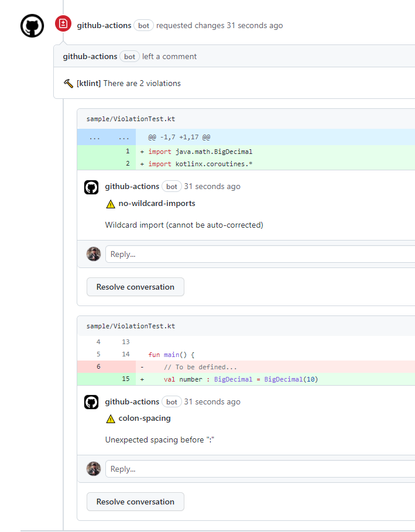

# GitHub Actions - ktlint-auto-review

:rocket: Automatically reviewed on Pull Request with [ktlint](https://ktlint.github.io/)

Inspired by [ScaCap/action-ktlint](https://github.com/ScaCap/action-ktlint) but without reviewdog.

## Getting started

1. Create `.github/workflows`

```yaml
name: test

on: [ pull_request ]
jobs:
  build:
    runs-on: ubuntu-latest
    steps:
      - uses: actions/checkout@v2
      - uses: minjunkweon/action-ktlint-auto-review@v1
        with:
          github_token: ${{ secrets.GITHUB_TOKEN }}
```

2. Just create PR and waiting for done.



## Parameters

You can inject parameter for action using `with:` options.

### `github_token` 

GitHub Token to create review on Pull Request. **`${{ secrets.GITHUB_TOKEN }}`** is auto-genereated value. So you don't need to setup.

### `ktlint_version`

If you want to define the specific ktlint version, define it. (ex. `0.44.0`)